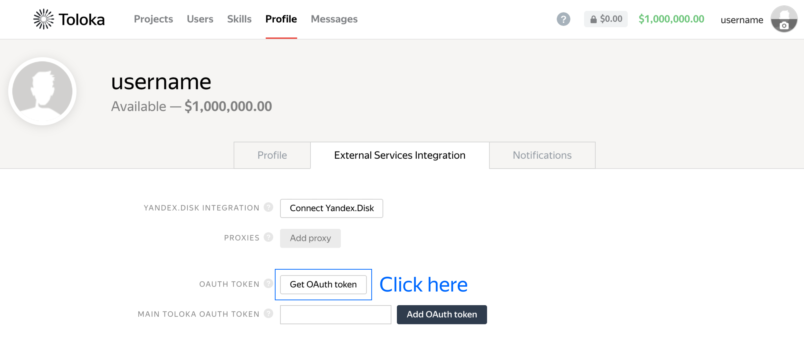
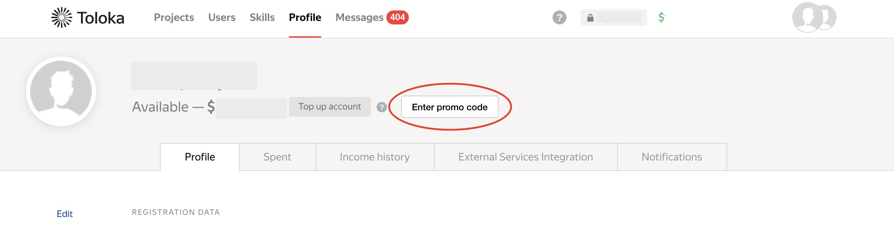
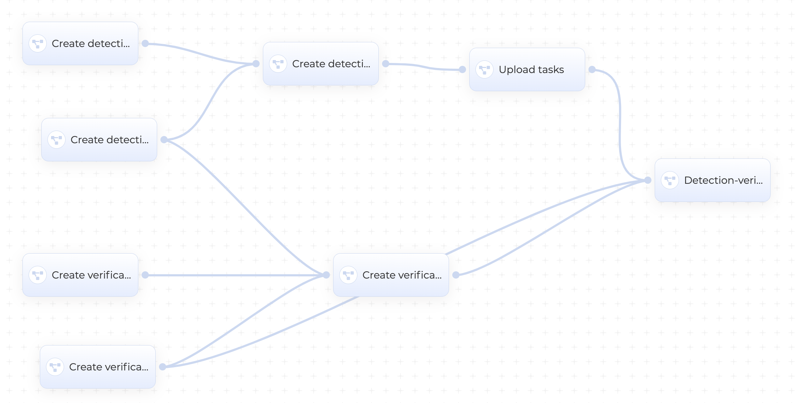

# Annotate Road Signs with Toloka and cnvgr.io

This is an implementation of [Annotating ground truth for object detection](https://github.com/Toloka/toloka-kit/blob/main/examples/1.computer_vision/object_detection/object_detection.ipynb) project to be run on **[cnvrg.io](https://cnvrg.io/)** platform. 

## Toloka
Toloka is a crowdsourcing platform that helps to analyze large volumes of data in a short period of time.

Examples of common tasks:
* Group the wide variety of items in your online store into categories.
* Find or verify information.
* Translate texts.

[Toloka-Kit](https://github.com/Toloka/toloka-kit) is an open-source library, integrated into Toloka API functionality.

### Useful links

- [Toloka Kit documentation](https://toloka.ai/docs/toloka-kit/?utm_source=github&utm_medium=site&utm_campaign=tolokakit)
- [Toloka homepage](https://toloka.ai/?utm_source=github&utm_medium=site&utm_campaign=tolokakit)
- [Toloka requester's guide](https://toloka.ai/docs/guide/index.html?utm_source=github&utm_medium=site&utm_campaign=tolokakit)
- [Toloka API documentation](https://toloka.ai/docs/api/concepts/about.html?utm_source=github&utm_medium=site&utm_campaign=tolokakit)

The best way to start is to test Toloka web interface by trying out [one of the tutorials](https://toloka.ai/docs/guide/concepts/usecases.html?utm_source=github&utm_medium=site&utm_campaign=tolokakit).

### Registration

1. [Register](https://toloka.ai/docs/guide/concepts/access.html?utm_source=github&utm_medium=site&utm_campaign=tolokakit) in Toloka as a requester.
2. Choose the backend:
  * The [production backend](https://toloka.yandex.com/for-requesters/?utm_source=github&utm_medium=site&utm_campaign=tolokakit) is used by default in this example.
  * The [sandbox backend](https://sandbox.toloka.yandex.com/for-requesters/?utm_source=github&utm_medium=site&utm_campaign=tolokakit) is a testing environment for Toloka. [Learn more](https://toloka.ai/docs/guide/concepts/sandbox.html?utm_source=github&utm_medium=site&utm_campaign=tolokakit).
3. [Add funds](https://toloka.ai/docs/guide/concepts/refill.html?utm_source=github&utm_medium=site&utm_campaign=tolokakit) to your Toloka account, if you're going to use the production version.
4. [Get an OAuth token](https://toloka.ai/docs/api/concepts/access.html#access__token?utm_source=github&utm_medium=site&utm_campaign=tolokakit) for your version. Go to **Profile** → **External Services Integration** → **Get Oauth Token**.

<table  align="center">
  <tr><td>
    
  </td></tr>
  <tr><td align="center">
    <b>Figure 1.</b> How to get an OAuth token.
  </td></tr>
</table>

### Enter promo code
To get acquainted with Toloka tools for free, you can use the promo code **TOLOKAKIT1** on $20 on your [profile page](https://toloka.yandex.com/requester/profile?utm_source=github&utm_medium=site&utm_campaign=tolokakit) after registration.

<table  align="center">
  <tr><td>
    
  </td></tr>
  <tr><td align="center">
    <b>Figure 2.</b> How to get an OAuth token.
  </td></tr>
</table>

## cnvrg.io

cnvrg.io is the world's most flexible end-to-end machine learning operating system built to empower AI developers to build high impact models, faster, on any AI infrastructure. With cnvrg.io, AI developers are given the freedom to run AI workloads where it is faster and most cost effective, in half the time. 
[Claim your free 8 CPU’s & 16GB free to run your AI](https://metacloud.cloud.cnvrg.io/sign-up).

## Running Road Signs Annotation project

1. [Create a project](https://app.cnvrg.io/docs/core_concepts/projects.html#creating-a-project) in cnvrg.io
2. [Connect this repo](https://app.cnvrg.io/docs/core_concepts/projects.html#git-integration) with a project in cnvrg.io
3. [Get an OAuth token](https://toloka.ai/docs/api/concepts/access.html#access__token?utm_source=github&utm_medium=site&utm_campaign=tolokakit) in Toloka
4. [Create a secret](https://app.cnvrg.io/docs/core_concepts/projects.html#project-secrets) called `toloka_token` in cnvrg.io
5. Import this project's [Flow](https://app.cnvrg.io/docs/core_concepts/flows.html#yaml-files) from [YAML config](traffic_signs_annotation.yaml) in cnvrg.io. The flow should look like this:
<table  align="center">
  <tr><td>
    
  </td></tr>
  <tr><td align="center">
    <b>Figure 3.</b> Project flow in cnvrg.io
  </td></tr>
</table>

6. Click on the 'Run Flow' button
7. In a few minutes you will get annotated road signs